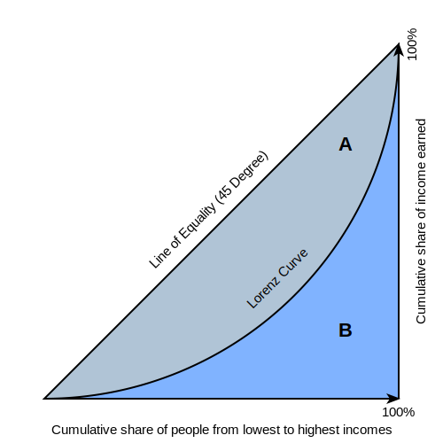

class: center, middle

# 文献

### 文章

---

# 文献

## 文章

### 文字

---

# 你好世界

---

# 插入网络图片

.center[]

---

# 插入本地图片--居中

.center[]

---

# 插入本地图片--默认

---
background-image: url(../pic/gini.svg)
background-size: cover
class: center

#背景图片占满整个PPT 

size参数设置大小

---
background-image: url(../pic/gini.svg)
background-size: 80%
background-position: 70% 70%
class: center，bottom

#背景图片调整位置

position参数设置位置
